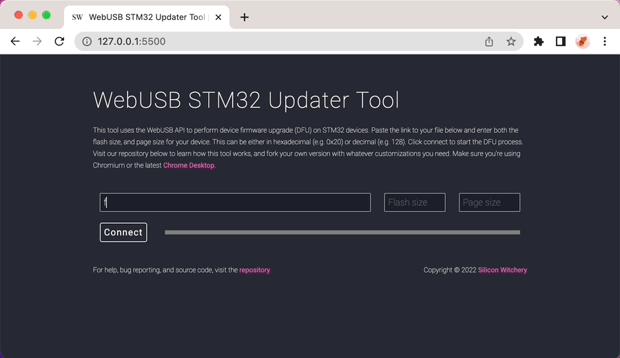

# Web USB based STM32 DFU App

A tool for programming STM32 based devices using Chrome and the WebUSB API. Check it out [here](https://siliconwitchery.github.io/web-stm32-updater/).

You will need to connect your STM32 device using USB, while within the bootloader mode. This is usually done by holding the BOOT pin high during reset or power on.

Next, enter the URL of your update file, the total flash size, page size, and hit connect. You should see your device listed.

As soon as you click connect, the DFU process will begin:

- Erasing all pages for the flash size specified
- Programming 2048 bytes at a time from the `.bin` file given
- Resetting the device and running the newly programmed application

For details on how the USB DFU works. Look at the `usbDfuDevice.js` file. You can easily integrated it into your own web app. See how it's done inside `index.html`

## Further reading

To understand how the USB DFU protocol, or WebUSB API works in detail, check out these links:

- [ST Application Note - USB DFU Protocol Used in the STM32 Bootloader](https://www.st.com/resource/en/application_note/cd00264379-usb-dfu-protocol-used-in-the-stm32-bootloader-stmicroelectronics.pdf)
- [USB Org - Device Class Spec for DFU](https://www.usb.org/sites/default/files/DFU_1.1.pdf)
- [Web.dev - Access USB Devices on the Web](https://web.dev/usb/)